<a href="https://Dimitarmusev.com/">
  <picture>
    <source media="(prefers-color-scheme: dark)" srcset="./header-dark.svg">
    <source media="(prefers-color-scheme: light)" srcset="./header.svg" />
    
  </picture>
</a>

<header>
  

    
    
  

</header>

 
 

  
<h2>Statistics</h2>

  

     
    

      
        
    

    

      <a href="https://github.com/dmusev?tab=repositories&q=&type=&language=&sort=stargazers">
        <picture>
          <source media="(prefers-color-scheme: dark)" srcset="https://github-readme-stats.vercel.app/api/top-langs/?layout=compact&username=dmusev&show_icons=true&title_color=c4b5fd&icon_color=475569&bg_color=90,0f172a,1e293b&text_color=cbd5e1&border_color=1e293b&text_bold=false&count_private=true">
          <source media="(prefers-color-scheme: light)" srcset="https://github-readme-stats.vercel.app/api/top-langs/?layout=compact&username=dmusev&count_private=true" />
          
        </picture>
      </a>
        
      <a href="https://github.com/dmusev?tab=repositories&q=&type=&language=&sort=stargazers">
        <picture>
          <source media="(prefers-color-scheme: dark)" srcset="https://github-readme-stats.vercel.app/api?username=dmusev&show_icons=true&title_color=c4b5fd&icon_color=475569&bg_color=90,0f172a,1e293b&text_color=cbd5e1&border_color=1e293b&text_bold=false&count_private=true&ring_color=7733ff">
          <source media="(prefers-color-scheme: light)" srcset="https://github-readme-stats.vercel.app/api?username=dmusev" />
          
        </picture>
      </a>
    

  

